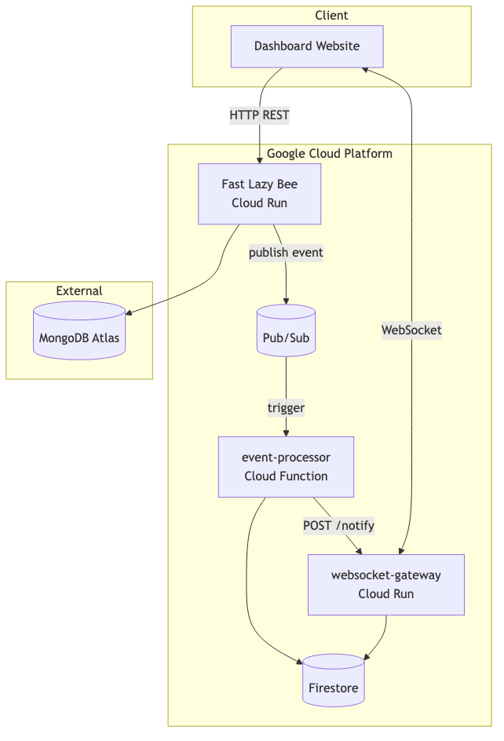
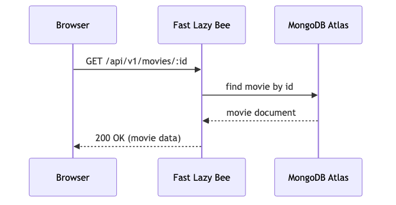
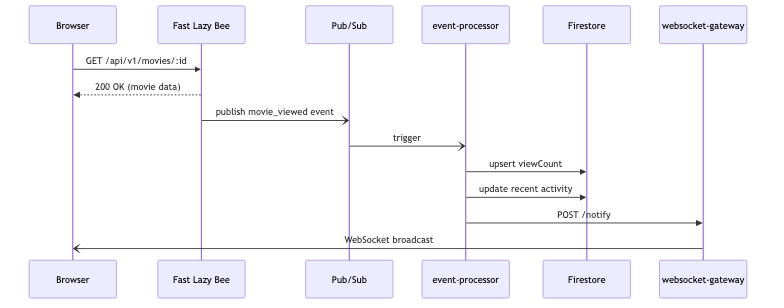

## 1. Arhitectura sistemului

Sistemul este compus din patru componente independente, fiecare cu responsabilități clare și deployate separat pe Google Cloud Platform.

Figura 1 — Diagrama componentelor sistemului. Fluxul sincron (retrieving movie) este ilustrat în Figura 2, iar fluxul asincron (analytics pipeline) în Figura 3.

Figura 2 — Fluxul sincron: clientul primeste datele filmului imediat.

Figura 3 — Fluxul asincron: evenimentul parcurge pipeline-ul Pub/Sub -> Cloud Function -> Firestore -> Gateway -> Dashboard.

### Servicii

**Fast Lazy Bee** (Cloud Run, Node.js/Fastify) este aplicația de bază, un REST API care servește date despre filme din MongoDB Atlas. La fiecare acces al unui film (`GET /api/v1/movies/:id`), publică un eveniment JSON în topicul Pub/Sub `movie-events` conținând `movieId`, `movieTitle`, `event` și `timestamp`. Serviciul este stateless și scalează orizontal.

**event-processor** (Cloud Function Gen2, Node.js) este triggerat automat de mesajele din Pub/Sub. Procesează evenimentele asincron: verifică idempotența prin colecția `processed-messages` din Firestore (deduplicare pe baza `messageId`), actualizează statistica `viewCount` în colecția `movie-stats` (upsert atomic), actualizează lista de activitate recentă în documentul `recent-activity/latest` folosind o tranzacție Firestore (asigurând atomicitate la scrieri concurente), și trimite o notificare HTTP POST la gateway.

**websocket-gateway** (Cloud Run, Node.js/Express + ws) menține conexiunile WebSocket cu clienții browser. La conectarea unui client nou, citește din Firestore starea curentă (top 20 filme și ultimele 15 activități) și o trimite ca mesaj `initial_stats`. La primirea unui POST `/notify` de la event-processor, difuzează mesajul `movie_viewed` tuturor clienților conectați. Menține de asemenea un contor al clienților conectați, difuzat ca mesaj `client_count` la fiecare conectare și deconectare.

**dashboard-website** (Firebase Hosting, React/TypeScript) este interfața web care se conectează prin WebSocket la gateway. La conectare primește `initial_stats` și populează starea locală. Actualizările în timp real vin prin mesaje `movie_viewed`. Implementează auto-reconectare cu retry la 3 secunde după o deconectare.

### Fluxul de date

1. Utilizatorul accesează un film prin API — Fast Lazy Bee returnează datele și publică eveniment în Pub/Sub
2. Pub/Sub triggerează event-processor (at-least-once delivery)
3. event-processor scrie în Firestore și notifică gateway-ul
4. Gateway-ul difuzează actualizarea tuturor clienților WebSocket conectați
5. Dashboard-ul actualizează UI-ul în timp real fără refresh

---

## 2. Analiza comunicării

Sistemul combină comunicare sincronă și asincronă, fiecare alegere justificată de cerințele specifice ale interacțiunii respective.

### Comunicare sincronă

Interacțiunea dintre client și Fast Lazy Bee este HTTP/REST sincron. Clientul trebuie să primească datele filmului imediat pentru a le afișa — un model asincron nu ar fi adecvat deoarece utilizatorul așteaptă răspunsul.

Interacțiunea dintre event-processor și websocket-gateway este de asemenea sincronă, prin HTTP POST. Dupa ce event-processor a scris în Firestore, notifică gateway-ul printr-un apel HTTP direct. Am ales sincron deoarece gateway-ul este un serviciu intern cu latență predictibilă. Dacă gateway-ul este indisponibil temporar, eroarea este logată dar nu blochează procesarea evenimentului — datele sunt deja salvate în Firestore, deci consistența nu este compromisă.

### Comunicare asincronă

Publicarea evenimentelor de la Fast Lazy Bee la event-processor se face prin Google Cloud Pub/Sub, complet asincron. Fast Lazy Bee publică evenimentul și returnează imediat răspunsul clientului fără a aștepta procesarea analytics. Aceasta este alegerea corectă deoarece actualizarea statisticilor nu face parte din calea critică a cererii utilizatorului. Un apel sincron ar adăuga sute de milisecunde la latența fiecărui GET de film, degradând experiența utilizatorului. Pub/Sub acționează ca un buffer similar cu un bounded buffer din teoria PCD, decuplând temporal producătorul de consumator și oferind reziliență la căderi parțiale.

Comunicarea dintre gateway și clienții browser se face prin WebSocket, bidirectionala și persistentă. Spre deosebire de polling sau Server-Sent Events, WebSocket permite serverului să împingă actualizări în timp real cu overhead minim, potrivit pentru un dashboard live.

---

## 3. Analiza consistenței

### Modelul de consistență

Sistemul implementează consistență eventuală (eventual consistency). Când un film este accesat, statisticile actualizate apar în dashboard cu un delay variabil. În fereastra de timp dintre publicarea evenimentului și procesarea sa de către event-processor, diferiți clienți pot vedea valori diferite ale `viewCount`.

Această alegere reflectă o decizie CAP: sistemul privilegiază Disponibilitatea și Toleranța la partiționare în detrimentul Consistenței stricte. Fast Lazy Bee returnează întotdeauna un răspuns, chiar dacă event-processor este temporar indisponibil. Datele vor converge eventual. Aceasta este alegerea corectă pentru un sistem de analytics unde o ușoară inconsistență temporară este acceptabilă, în contrast cu un sistem de plăți unde consistența strictă ar fi critică.

### Idempotența

Pub/Sub garantează livrare at-least-once: un mesaj poate fi procesat de două ori dacă event-processor nu confirmă primirea în termenul alocat. event-processor implementează idempotență prin mai multe mecanisme. Înainte de orice procesare, verifică dacă `messageId` există în colecția `processed-messages` din Firestore. Dacă da, sare procesarea și returnează status `duplicate`. Actualizarea `viewCount` folosește `FieldValue.increment(1)`, o operație atomică la nivel de field. Documentul `recent-activity/latest` este actualizat într-o tranzacție Firestore, prevenind race conditions la scrieri paralele de la mai multe instanțe ale Cloud Function.

---

## 4. Performanță și scalabilitate

Toate testele au fost executate cu serviciile deployate pe Google Cloud Run (us-central1). Testele _warm_ au fost efectuate cu `--min-instances=1` pentru toate serviciile. Testele _cold_ au fost efectuate cu `--min-instances=0` și o așteptare pană serviciile au scalat la 0.

### 4.1 Latență end-to-end

Măsoară timpul de la `GET /movies/:id` pe Fast Lazy Bee până la primirea mesajului `movie_viewed` pe WebSocket (20 rulări per scenariu).

**Rezultate WARM:**

| Metrică    | Valoare |
| ---------- | ------- |
| Successful | 20/20   |
| Min        | 329ms   |
| Max        | 1459ms  |
| Average    | 577ms   |
| p50        | 422ms   |
| p95        | 1080ms  |
| p99        | 1459ms  |

**Rezultate COLD:**

| Metrică | Warm (runs 2-20) | Cold (run 1) |
| ------- | ---------------- | ------------ |
| p50     | 492ms            | 10672ms      |
| p95     | 1246ms           | —            |
| p99     | 1246ms           | 10672ms      |

Penalitatea de cold start pentru run 1 (10672ms față de 492ms warm p50) reflectă inițializarea simultană a trei servicii: Fast Lazy Bee, event-processor și gateway, fiecare necesitând câteva secunde pentru pornire la rece.

### 4.2 Fereastra de consistență eventuală

Măsoară timpul de la `GET /movies/:id` până la actualizarea `viewCount` în Firestore, verificat prin polling la gateway (10 rulări per scenariu).

**Rezultate WARM:**

| Metrică    | Valoare |
| ---------- | ------- |
| Successful | 10/10   |
| Min        | 839ms   |
| Max        | 1620ms  |
| Average    | 1101ms  |
| p50        | 901ms   |
| p95        | 1620ms  |
| p99        | 1620ms  |

**Rezultate COLD (toate serviciile la zero):**

| Metrică    | Valoare |
| ---------- | ------- |
| Successful | 10/10   |
| Min        | 867ms   |
| Max        | 60528ms |
| Average    | 7128ms  |
| p50        | 961ms   |
| p95        | 60528ms |
| p99        | 60528ms |

Nota: Un run anterior în condiții similare a produs un p99 de doar 7655ms, sugerând că nu toate serviciile ajunseseră complet la zero. Valoarea de 60.5s este reprezentativă pentru un cold start complet al întregului pipeline.

Fereastra de consistență warm (0.9-1.6s) reflectă latența cumulată a pipeline-ului asincron: publicare Pub/Sub (~50ms), trigger Cloud Function (~200ms), scriere Firestore (~300ms), și intervalul de polling (500ms). Variabilitatea provine din fluctuațiile de latență ale Pub/Sub și timpii de procesare Firestore.

### 4.3 Throughput Cloud Function sub sarcină variabilă

Metodologie: `hey` trimite cereri la Fast Lazy Bee, fiecare cerere publicând un eveniment Pub/Sub. După 30s, verificăm câte evenimente au fost procesate în Firestore.

| Concurență | Req/sec | p50   | p99    | Erori | Evenimente procesate |
| ---------- | ------- | ----- | ------ | ----- | -------------------- |
| 10         | 51.9    | 169ms | 397ms  | 0%    | 100/100 (100%)       |
| 50         | 94.4    | 336ms | 924ms  | 0%    | 231/500 (46%)        |
| 100        | 81.6    | 760ms | 9675ms | 0%    | 419/1000 (42%)       |

La concurență 10, toate evenimentele sunt procesate în 30s, cu latență redusă și stabilă. La concurență 50, doar 46% din evenimente sunt procesate în fereastra de 30s — Pub/Sub bufferează restul, care vor fi procesate ulterior. La concurență 100, latența p99 ajunge la 9.67s, iar throughput-ul scade față de c=50. Bottleneck-ul principal este MongoDB Atlas M0: câteva cereri ating 9.8s din cauza epuizării pool-ului de conexiuni. Cu un cluster MongoDB dedicat, sistemul ar scala liniar.

### 4.4 Comportamentul WebSocket la reconectare

Metodologie: Gateway-ul este crashat prin endpoint-ul `/crash`, Cloud Run detectează containerul oprit și pornește unul nou.

| Rulare | Timp recuperare |
| ------ | --------------- |
| 1      | 1579ms          |
| 2      | 1583ms          |
| 3      | 1591ms          |
| Medie  | 1584ms          |

Cloud Run pornește o instanță nouă în aproximativ 1.6s. Dashboard-ul are retry la 3s. La reconectare, clientul primește mesajul `initial_stats` cu datele complete din Firestore — nicio pierdere de stare.

---

## 5. Reziliență

### Comportament la căderi parțiale

Când **Fast Lazy Bee** este indisponibil, clienții nu pot accesa filme. event-processor și gateway-ul continuă să funcționeze, iar dashboard-ul afișează statisticile existente din Firestore. Funcționalitatea de analytics este separată de API-ul principal. Însă nu vor fi inregistrate statistici noi.

Când **event-processor** este indisponibil, Pub/Sub bufferează mesajele (cu retenție configurabilă, implicit 7 zile). La revenirea Cloud Function, toate evenimentele acumulate sunt procesate. Nu există pierdere de date, iar idempotența previne procesarea duplicată.

Când **websocket-gateway** cade, clienții browser detectează `onclose` și încearcă reconectare la 3s. Cloud Run pornește o instanță nouă în ~1.6s. La reconectare, gateway-ul citește Firestore și trimite `initial_stats` — starea dashboard-ului este complet restaurată. Evenimentele publicate în perioada de downtime sunt scrise în Firestore de event-processor, independent de gateway, deci datele sunt consistente.

### Mecanisme de recuperare

Auto-healing-ul Cloud Run detectează containerele moarte și le înlocuiește automat (~1.6s pentru gateway). Idempotența event-processor asigură că relivrările Pub/Sub nu produc date duplicate. Auto-reconectarea WebSocket în dashboard restaurează starea completă din Firestore la fiecare reconectare. Pub/Sub oferă durabilitate mesajelor la eșecul event-processor. Tranzacțiile Firestore serializează scrierile concurente pentru activitatea recentă.

---

## 6. Comparație cu sisteme reale — Netflix

Netflix folosește o arhitectură similar event-driven pentru colectarea și afișarea metricilor de vizionare în timp real, la o scară de miliarde de evenimente pe zi.

### Similitudini

Ambele sisteme folosesc un model event-driven cu decuplare prin cozi de mesaje: Fast Lazy Bee publică în Pub/Sub similar cu modul în care serviciile Netflix publică în [Apache Kafka](https://netflixtechblog.com/kafka-inside-keystone-pipeline-dd5aeabaf6bb). Consistența eventuală este acceptată pentru analytics în ambele sisteme. Componentele sunt stateless și scalabile orizontal, cu stocare stateful separată. Idempotența procesării evenimentelor este implementată explicit în ambele arhitecturi.

### Diferențe

Netflix folosește [Apache Kafka](https://netflixtechblog.com/evolution-of-the-netflix-data-pipeline-da246ca36905) cu throughput de milioane de mesaje pe secundă, față de Google Cloud Pub/Sub care operează la mii pe secundă pe tier-ul utilizat. Pentru stocarea statisticilor, Netflix folosește [Apache Cassandra](https://netflixtechblog.com/scaling-time-series-data-storage-part-i-ec2b6d44ba39) distribuit georeplicat, optimizat pentru scrieri masive, față de Firestore (managed, single-region în cazul nostru). Sistemul nostru a demonstrat bottleneck la MongoDB Atlas M0 la sarcini de 100 cereri concurente — Netflix operează clustere MongoDB și Cassandra dedicate cu zeci de noduri.

O diferență fundamentală este backpressure-ul explicit: Netflix implementează mecanisme de backpressure la nivel de Kafka consumer groups pentru a preveni supraîncărcarea procesatorilor, vizibil în platforma [Mantis](https://netflixtechblog.com/open-sourcing-mantis-a-platform-for-building-cost-effective-realtime-operations-focused-5b8ff387813a). Sistemul nostru se bazează pe bufferizarea implicită a Pub/Sub, ceea ce explică procesarea de doar 42% din evenimente în 30s la c=100 - evenimentele nu sunt pierdute, dar sunt procesate cu delay.

---

## 7. Concluzii

Sistemul implementat demonstrează o arhitectură distribuită event-driven funcțională, cu componentele corect separate și comunicând prin protocoale adecvate. Principalele rezultate măsurate sunt: latență end-to-end warm cu p50=422ms și p99=1459ms, fereastră de consistență eventuală între 839ms și 1620ms în scenariul warm, recuperare după crash gateway în ~1.6s, și bottleneck identificat la MongoDB Atlas M0 la sarcini ridicate.

Sistemul alege disponibilitate în detrimentul consistenței stricte, o decizie justificată pentru un dashboard de analytics unde o ușoară inconsistență temporară este acceptabilă. Idempotența și tranzacțiile Firestore previn corupția datelor chiar la scrieri concurente sau relivrări Pub/Sub.

### Utilizarea instrumentelor de inteligență artificială

În cadrul acestui proiect, am utilizat **Claude Opus si Sonnet 4.6** ca asistent de programare integrat în VS Code (extensia Cline) pentru generare de cod (scaffolding-ul serviciilor, componentele React, scripturile de metrici), și structurarea raportului. Tot codul generat a fost validat, testat și adaptat de echipă.

---

## Referințe

- Netflix Tech Blog — [Kafka Inside Keystone Pipeline](https://netflixtechblog.com/kafka-inside-keystone-pipeline-dd5aeabaf6bb)
- Netflix Tech Blog — [Evolution of the Netflix Data Pipeline](https://netflixtechblog.com/evolution-of-the-netflix-data-pipeline-da246ca36905)
- Netflix Tech Blog — [Scaling Time Series Data Storage](https://netflixtechblog.com/scaling-time-series-data-storage-part-i-ec2b6d44ba39)
- Netflix Tech Blog — [Open-Sourcing Mantis](https://netflixtechblog.com/open-sourcing-mantis-a-platform-for-building-cost-effective-realtime-operations-focused-5b8ff387813a)
- Google Cloud — [Cloud Run Documentation](https://cloud.google.com/run/docs)
- Google Cloud — [Cloud Pub/Sub Documentation](https://cloud.google.com/pubsub/docs)
- Google Cloud — [Firestore Documentation](https://cloud.google.com/firestore/docs)
